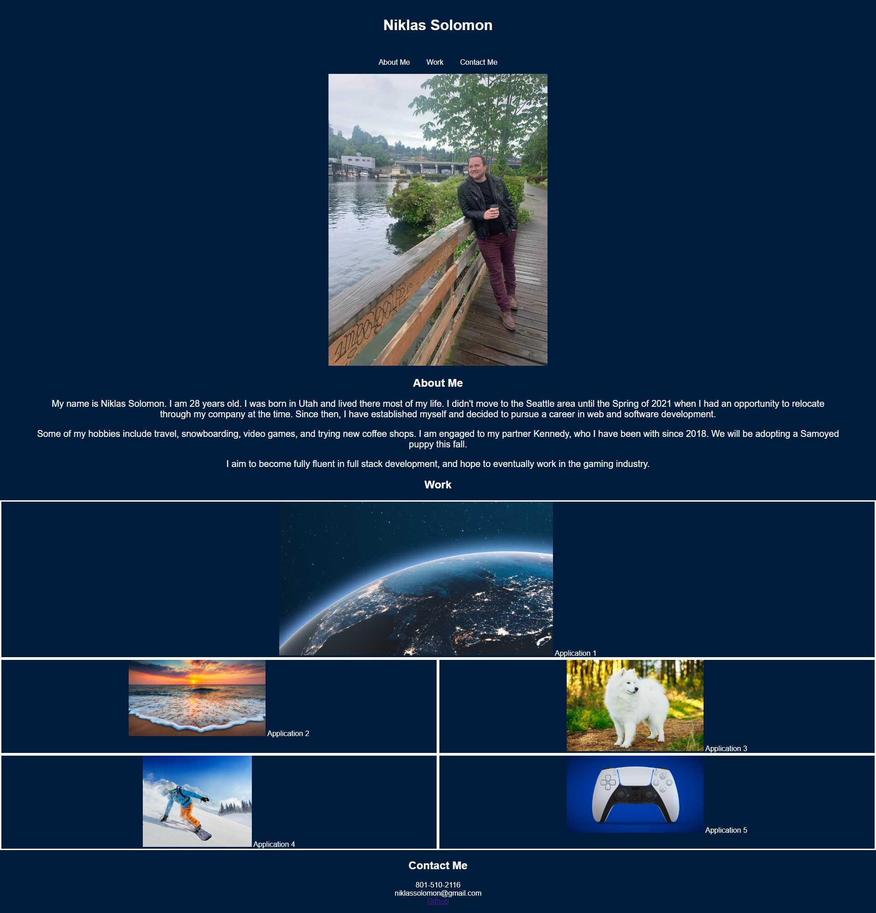

# Niklas-Solomon-Portfolio

## Goal:
 The goal of this project was to create a portfolio webpage from scratch using the html and css techniques we've learned over the past few weeks of class. The webpage should be personalized and show applications that the student has (or will have) created. The page should be navigable using links to different sections of the page, as well as links to the applications mentioned before.

## How:
Construct a wireframe for a visual reference of the intended layout. Divide HTML into semantic elements; add relevant content to each element and nest within divs to allow for class application. Link a CSS file that will apply desired styling to each element. Apply id tags to each section to allow links to scroll to section. Nest images within anchor tags for visual reference to applications.

## Why:
This project will display ability to construct a webpage from scratch as well as showcase knowledge learned about HTML and CSS.

## Result:
The portfolio has the student name, picture, and a nav list of links that scroll to corresponding sections of the webpage. The About Me section details a quick biography of the student. The Work section organizes images labeled with application titles that are linked to an outside application (to be replaced at a later date). The first application is larger in size than the others. The images are responsive and flexible to the size of the display. The final section lists contact information.

[Link to live webpage](https://niklassolomon.github.io/Niklas-Solomon-Portfolio/)